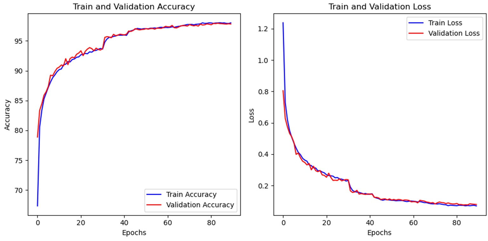
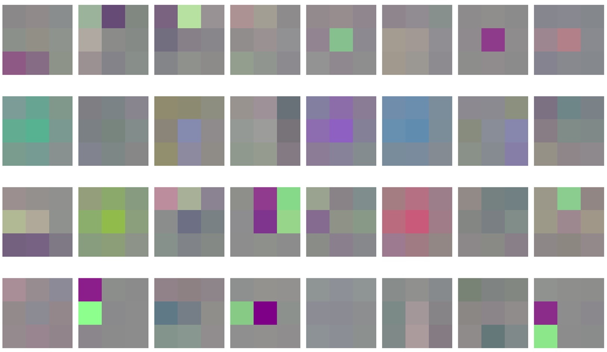
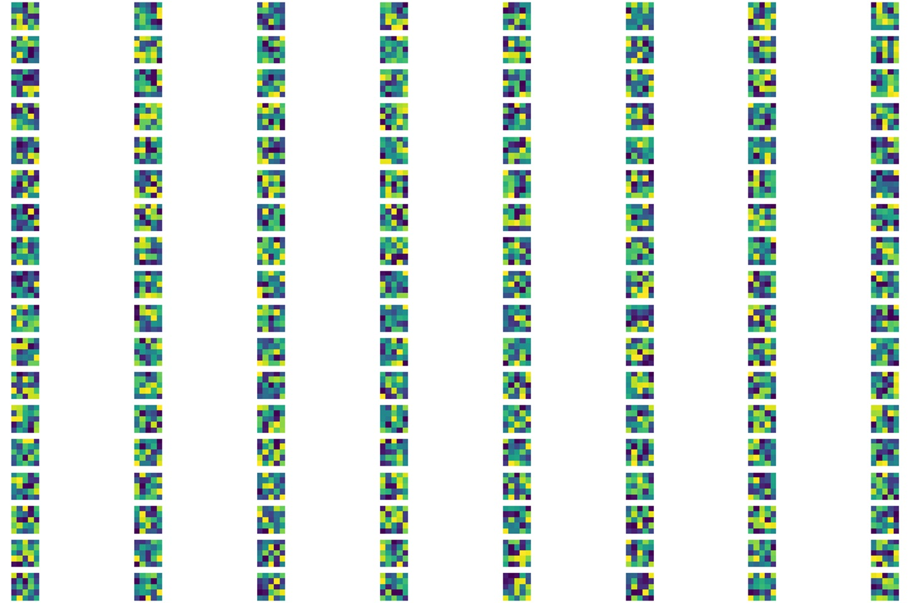

# NYCU_Machine Learning 2023-classification
### 312605015詹恆瑜
## Author
|Student ID|GitHub Account|Name|Email| 
| :--:    | :--:   |:--:  | :--: |
|312605015|312605015|詹恆瑜|happydog101155@gmail.com| 

---
>環境檔: env.yml
>>channels:
>>1. pytorch
>>2. conda-forge
>>3. nvidia
>>4. defaults
##
>執行程式碼: class_efficientnet,py
##
>輸出檔案
>>1. 權重檔: simpson_eff_model_epoch80 、simpson_eff_model_epoch90  
>>2. test預測csv檔: predictions_epoch80、predictions_epoch90

##
>其他資料(訓練照片、介紹)
>>1. firstlayer.jpg  
>>2. fourthlayer.jpg  
>>3. loss_and_acc.jpg  
>>4. README.md
##


1.作法說明
===

|  | MobileNet_V2 | EfficientNet-b0 |
| :--:    | :--:      |:--:    |
| Epochs  |   35      |   90   |
| val acc |   89%     | 97.822% |
| val loss|    0.383       | 0.079 |
|kaggle score|  0.89    | 0.9805 |

這次的Simpson classification，我前後使用Pytorchvision的預訓練模型來做測試-MobileNet、EfficientNet-b0，因為這次的資料量大了許多，所以挑選訓練weights數比較少的模型來作首選，但發現收斂後的效果不夠好，於是換為EfficientNet-b0來做測試，並同時比較其結果。

一開始使用MobileNet來跑時，速度確實快了一些，隨著調高Epoch的數目後，明顯val acc到了89%就到了極限，即使在模型中自己加入dropout且嘗試dropout0.2~0.5，成果還是卡在88和89。

最後挑遠與嘗試後，我改使用EffectientNet來測試，我從Epoch40調到65，最後到90，我在這時實驗中發現到learn rate調降對accuracy的效果提升很多，原本都在93點多持續不怎麼改變，但降了一半的學習率之後就提升了1%多，到最後Accuracy才在97.多%徘迴很久。最後停在97.多，我想差不多已經到收斂了，大概從epoch 80開始Accuracy就一直在97.6%上下徘迴，即使學習率有再減半，但是效果沒有再明顯改善，再訓練下去又機會變成過擬和，如果想要再把效果提升，應該要在微調和測試其他參數或優化器，於是我最後把訓練到後面開始收斂的第epoch80存下的權重檔存下來，並預測csv檔上繳kaggle，之後我把我的epoch85、epoch90同樣上繳到kaggle，發現結果確實是epoch80的效果是最好的，這也同時驗證了我的想法，並在最後印出訓練損失圖和Accuracy圖可以更清楚知道模型的狀況。

2.程式方塊圖與寫法
===============

首先import必要的函式來執行之後的程式
``` python
import torch
import torch.nn as nn
from torchvision import transforms
from torch.utils.data import DataLoader, random_split
from torchvision.datasets import ImageFolder
from PIL import Image
import os
from sklearn.model_selection import KFold
import matplotlib.pyplot as plt
from torch.optim.lr_scheduler import ReduceLROnPlateau
import pandas as pd
import torchvision.transforms.v2 as T
from efficientnet_pytorch import EfficientNet 
import numpy as np
```
接著使用cuda來跑再確定是否有正確使用到gpu，之後定義所需資料集、挑選使用的預訓練模型、loss function、optimizer、ReduceLROnPlateau，並上下測試與查詢效果來調整可調整的參數，我把原先ReduceLROnPlateau的patience值從3調為2，讓他後期的learnrate可以降得比較快，因為前幾次的測試下，後期降快一些對訓練效果好很多。
``` python
device = torch.device("cuda" if torch.cuda.is_available() else "cpu")
print(device)
# 定義 customdataset
class CustomDataset(torch.utils.data.Dataset):
    def __init__(self, data_dir, transform=None):
        self.data_dir = data_dir
        self.transform = transform
        self.image_list = []
        self.labels = []

        for label, character in enumerate(os.listdir(data_dir)):
            character_path = os.path.join(data_dir, character)
            if os.path.isdir(character_path):
                for image_file in os.listdir(character_path):
                    if image_file.endswith(".jpg"):
                        self.image_list.append(os.path.join(character_path, image_file))
                        self.labels.append(label)

    def __len__(self):
        return len(self.image_list)

    def __getitem__(self, idx):
        img_name = self.image_list[idx]
        image = Image.open(img_name).convert('RGB')
        label = self.labels[idx]

        if self.transform:
            image = self.transform(image)

        return image, label

# 定義預訓練模型:EfficientNet model和所使用的預訓練權重
model = EfficientNet.from_pretrained('efficientnet-b0', num_classes=50)

model = model.to(device)

criterion = nn.CrossEntropyLoss()
optimizer = torch.optim.Adam(model.parameters(), lr=0.001)
scheduler = ReduceLROnPlateau(optimizer, mode='min', patience=2, factor=0.5, verbose=True) 
```

接著定義教授給四種噪聲並在之後會引用，並定義其他資料擴充的transform function，之後的照片會引用來transform，最後再定義custom collate來讓PIL改為tensor，如此才符合transform function格式的要求。
``` python
class AddGaussianNoise(object):
    def __init__(self, mean=0., std=1.):
        self.std = std
        self.mean = mean

    def __call__(self, tensor):
        return tensor + torch.randn(tensor.size()) * self.std + self.mean


class AddSpeckleNoise(object):
    def __init__(self, noise_level=0.1):
        self.noise_level = noise_level

    def __call__(self, tensor):
        noise = torch.randn_like(tensor) * self.noise_level
        noisy_tensor = tensor * (1 + noise)
        noisy_tensor = torch.clamp(noisy_tensor, 0, 1)
        return noisy_tensor

class AddPoissonNoise(object):
    def __init__(self, lam=1.0):
        self.lam = lam

    def __call__(self, tensor):
        noise = torch.poisson(self.lam * torch.ones(tensor.shape))
        noisy_tensor = tensor + noise / 255.0
        noisy_tensor = torch.clamp(noisy_tensor, 0, 1)
        return noisy_tensor

class AddSaltPepperNoise(object):
    def __init__(self, salt_prob=0.05, pepper_prob=0.05):
        self.salt_prob = salt_prob
        self.pepper_prob = pepper_prob

    def __call__(self, tensor):
        noise = torch.rand(tensor.size())
        tensor[(noise < self.salt_prob)] = 1
        tensor[(noise > 1 - self.pepper_prob)] = 0
        return tensor

transform = T.Compose([
    T.ToTensor(),  

    T.RandomApply([T.RandomHorizontalFlip()], p=0.1),
    T.RandomApply([T.RandomVerticalFlip()], p=0.1),
    T.RandomApply([T.RandomRotation(10)], p=0.1),

    T.RandomApply([T.ColorJitter(brightness=0.4, contrast=0.4, saturation=0.4, hue=0.1)], p=0.1),
    T.RandomGrayscale(p=0.1),
    T.RandomInvert(p=0.1),
    T.RandomPosterize(bits=2, p=0.1),
    T.RandomApply([T.RandomSolarize(threshold=1.0)], p=0.05),
    T.RandomApply([T.RandomAdjustSharpness(sharpness_factor=2)], p=0.1),

    T.RandomApply([AddGaussianNoise(0., 0.05)], p=0.1),
    T.RandomApply([AddPoissonNoise(lam=0.1)], p=0.1),
    T.RandomApply([AddSpeckleNoise(noise_level=0.1)], p=0.1),
    T.RandomApply([AddSaltPepperNoise(salt_prob=0.05, pepper_prob=0.05)], p=0.1),

    T.RandomApply([T.RandomPerspective(distortion_scale=0.6, p=1.0)], p=0.1),
    T.RandomApply([T.RandomAffine(degrees=(30, 70), translate=(0.1, 0.3), scale=(0.5, 0.75))], p=0.1),
    T.RandomApply([T.ElasticTransform(alpha=250.0)], p=0.1),

    T.RandomApply([T.GaussianBlur(kernel_size=(5, 9), sigma=(0.1, 5.))], p=0.1),

    T.RandomApply([AddGaussianNoise(0., 0.001)], p=1.0),
    T.ToPILImage(),
    T.ToTensor(),  
])

def custom_collate(batch):
    """
    Custom collate function to convert PIL Images to tensors.
    """
    new_batch = [(transform(image), label) for image, label in batch]
    return torch.utils.data.dataloader.default_collate(new_batch)
```

接著將訓練資料的路徑和資料設定好自己存放的位置後，再使用5-fold cross validation來分割訓練照片和驗證照片，在讀取時式亂數讀取，接著把epoch的數值設定好開始訓練，並將每個epoch計算的validation acc和validation loss都印出來，並把預測csv和儲存權重檔設定為每5個epoch做一次。  
``` python
# 設定訓練資料位置並做transform
data_dir = r'c:\software\python\simpson_aug\train\train'
dataset = CustomDataset(data_dir=data_dir, transform=transform)


kf = KFold(n_splits=5, shuffle=True, random_state=42)
for train_index, val_index in kf.split(dataset):
    train_dataset = torch.utils.data.Subset(dataset, train_index)
    val_dataset = torch.utils.data.Subset(dataset, val_index)
    train_loader = DataLoader(train_dataset, batch_size=32, shuffle=True, collate_fn=custom_collate)
    val_loader = DataLoader(val_dataset, batch_size=32, shuffle=False, collate_fn=custom_collate)

# 定義存放訓練和驗證資料的矩陣
train_accuracies = []
val_accuracies = []
train_losses = []
val_losses = []

# 得到訓練的全部的角色名字種類
classes = sorted(os.listdir(data_dir))

# 訓練迴圈
for epoch in range(90):

        model.train()
        running_loss = 0.0
        correct = 0
        total = 0
        for images, labels in train_loader:
            images = images.to(device)
            labels = labels.to(device)
            optimizer.zero_grad()
            outputs = model(images)
            loss = criterion(outputs, labels)
            loss.backward()
            optimizer.step()
            running_loss += loss.item()

            _, predicted = torch.max(outputs.data, 1)
            total += labels.size(0)
            correct += (predicted == labels).sum().item()

        train_losses.append(running_loss/len(train_loader))
        train_accuracies.append(100 * correct / total)

        model.eval()
        correct = 0
        total = 0
        val_loss = 0
        with torch.no_grad():
            for images, labels in val_loader:
                images = images.to(device)
                labels = labels.to(device)
                outputs = model(images)
                loss = criterion(outputs, labels)
                val_loss += loss.item()

                _, predicted = torch.max(outputs.data, 1)
                total += labels.size(0)
                correct += (predicted == labels).sum().item()

        val_losses.append(val_loss/len(val_loader))
        val_accuracies.append(100 * correct / total)

        print(f"Epoch {epoch+1}, Val Loss: {val_loss/len(val_loader)}, Val Accuracy: {100 * correct / total}")

        val_loss = val_loss/len(val_loader)
        scheduler.step(val_loss)

    # 每5個epochs存下其權重並測試
        if (epoch+1) % 5 == 0:
            checkpoint_path = os.path.join('c:\\software\\python\\simpson_aug', f'simpson_eff_model_epoch{epoch+1}.pth')
            torch.save(model.state_dict(), checkpoint_path)

            # 測試模型並印出csv檔
            test_data_dir = r'c:\software\python\simpson_aug\test-final\test-final'

            class TestDataset(torch.utils.data.Dataset):
                def __init__(self, data_dir, transform=None):
                    self.data_dir = data_dir
                    self.transform = transform
                    self.image_list = [os.path.join(data_dir, img) for img in os.listdir(data_dir)]

                def __len__(self):
                    return len(self.image_list)

                def __getitem__(self, idx):
                    img_name = self.image_list[idx]
                    image = Image.open(img_name).convert('RGB')

                    if self.transform:
                        image = self.transform(image)

                    return image

            model.load_state_dict(torch.load(checkpoint_path))
            model.eval()
            model = model.to(device)

            test_dataset = TestDataset(data_dir=test_data_dir, transform=transform)
            test_loader = DataLoader(test_dataset, batch_size=32, shuffle=False)

            predictions = []

            with torch.no_grad():
                for images in test_loader:
                    images = images.to(device)
                    outputs = model(images)
                    _, predicted = torch.max(outputs.data, 1)
                    predictions.extend(predicted.cpu().numpy())

            test_image_list = os.listdir(test_data_dir)
            df = pd.DataFrame({'id': [int(img.split('.')[0]) for img in test_image_list], 
                            'character': [classes[i] for i in predictions]})
            df = df.sort_values(by='id')
            df.to_csv(f'c:\\software\\python\\simpson_aug\\predictions_epoch{epoch+1}.csv', index=False)
```

最後畫出訓練的train和validation的acc和loss，如此就可以更清楚看到訓練時的狀況。 
```python
# 劃出訓練和驗證的Accuracy和loss function
plt.figure(figsize=(10, 5))

plt.subplot(1, 2, 1)
plt.plot(train_accuracies, label='Train Accuracy', color='blue')
plt.plot(val_accuracies, label='Validation Accuracy', color='red')
plt.xlabel('Epochs')
plt.ylabel('Accuracy')
plt.title('Train and Validation Accuracy')
plt.legend()

plt.subplot(1, 2, 2)
plt.plot(train_losses, label='Train Loss', color='blue')
plt.plot(val_losses, label='Validation Loss', color='red')
plt.xlabel('Epochs')
plt.ylabel('Loss')
plt.title('Train and Validation Loss')
plt.legend()

plt.tight_layout()
plt.show()
```
把自己匯出的權重檔帶入使用的預訓練模型，並取得第一層的權重並畫出來，用一樣的概念同樣畫出第四層的權重，並比較其差異。
```python
models = EfficientNet.from_name('efficientnet-b0', in_channels=3, num_classes=50) 

# 載入我epoch80的權重
weight_path = "C:/software/python/simpson_aug/simpson_eff_model_epoch80.pth"
custom_weights = torch.load(weight_path)

models._conv_stem.weight = nn.Parameter(custom_weights['_conv_stem.weight'])

# 得到一層的新權重
first_layer_weights = models._conv_stem.weight.data.cpu().numpy()

# 正規化並畫圖第1層權重
weights_min = np.min(first_layer_weights)
weights_max = np.max(first_layer_weights)
first_layer_weights = (first_layer_weights - weights_min) / (weights_max - weights_min)

n_kernels = first_layer_weights.shape[0]
n_rows = int(np.ceil(n_kernels / 8))
fig, axarr = plt.subplots(n_rows, 8, figsize=(15, 15))

for idx in range(n_kernels):
    row = idx // 8
    col = idx % 8
    ax = axarr[row, col]
    ax.imshow(np.transpose(first_layer_weights[idx], (1, 2, 0)), interpolation='nearest')
    ax.axis('off')

plt.tight_layout()
plt.show()

#得到第四層的權重
fourth_layer_weights = models._blocks[3]._depthwise_conv.weight.data.cpu().numpy()

# 正規化並畫圖第4層權重
weights_min = np.min(fourth_layer_weights)
weights_max = np.max(fourth_layer_weights)
fourth_layer_weights = (fourth_layer_weights - weights_min) / (weights_max - weights_min)

n_kernels = fourth_layer_weights.shape[0]
n_rows = int(np.ceil(n_kernels / 8))
fig, axarr = plt.subplots(n_rows, 8, figsize=(15, 15))

for idx in range(n_kernels):
    row = idx // 8
    col = idx % 8
    ax = axarr[row, col]
    ax.imshow(np.transpose(fourth_layer_weights[idx], (1, 2, 0)), interpolation='nearest')
    ax.axis('off')

plt.tight_layout()
plt.show()
```

3.畫圖做結果分析
===

[EfficientNet]由上圖可以一開始看到當我學習率減半時，我的Accuracy和loss都有突然間的進步，讓我學習效果可以更好，尤其前面兩次減半的時候，到後面減半的時後效果就沒有明顯的改變了，差不多到epoch80的時候train和validation都趨於收斂且重合，隨著epoch增加時，效果不再有明顯改變，就算在epoch87有在降低學習率，但已經沒有明顯改變，所以大概在epoch80達到了收斂，在上繳kaggle的結果上也發現epoch80的效果都比epoch85、epoch90來的好，所以更加我更加認定了我的假設。


從第一層權重可以看到EfficientNet的第一層主要在抓色塊，比較看不出來有什麼線條被抓出來，可能也跟他的模型結構有關。


從第四層的權重可以明顯看出來這層的權重比第一層多很多，且每一張從3*3變成了5*5，從這邊可以知道色塊被抓得更仔細了，線條感有比一開始第一層來的明顯。


4.討論預測值誤差很大的，是怎麼回事?
===
我一開始使用MobileNet預訓練模型訓練時，發現一開始訓練的Accuracy就不低了，隨著訓練的epoch的提升效果也跟著上升，最後才慢慢收斂，此時我上傳去kaggle結果精確度只有50幾%，最後我改為使用EfficientrNet來做效果更明顯，另外，我加上資料擴增再去做訓練，最後kaggle呈現的成果確實比較好，所以我認為誤差會大的原因有使用的模型、訓練的次數、有無做資料擴增有相當大的關係，但相對的精度越高，訓練的時間也提高了不少。


5.如何改進
===
經過這次作業實作讓我發現到預訓練模型的挑選、參數的調整及epoch數目的多寡非常重要，我想我可以透過挑選更加精準的預訓練模型來做看看，在硬體及時間的允許下我想訓練的效果可以再提高一點，可以的話我想我可以把預訓練模型加些dropout或調整學習率的降低速度，可以讓epoch跑的數量少一點就可以到達收斂，


6.心得
===
透過這次的作業，我學會如何在沒有csv檔為label的情況下，自行找對應的資料夾名當作label，且在執行的途中，我發現到速度真的因為龐大的資料量，使得執行下來真的非常的久，於是我開始研究如何使用電腦的gpu來執行，從一開始研究cuda和本和torch的版本需要符合到後面執行成功後，才使速度提升了些，但跑到後面還是非常有限，於是我組了一台顯卡為3080的來跑，速度才從原先的一天多兩天減半了大半時間，這讓我深刻地體會到硬體好的重要性，才讓我能把我的epoch數給提高到90，讓訓練更加完全，這次作業也讓我明白提前驗證模型可行性的重要，如此才不會等了半天才發現自己的程式碼有錯，，我在驗證寫的模型沒問題後，我讓每五個epoch就存下其權重檔，並預測其csv檔，如此我就不需要等到最後才得到相對應的訓練結果。